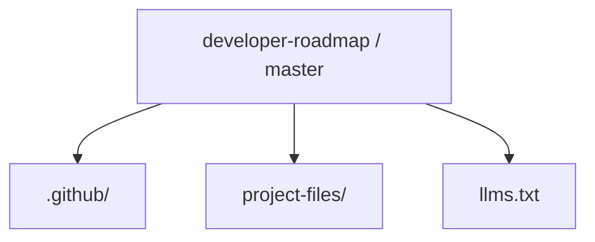
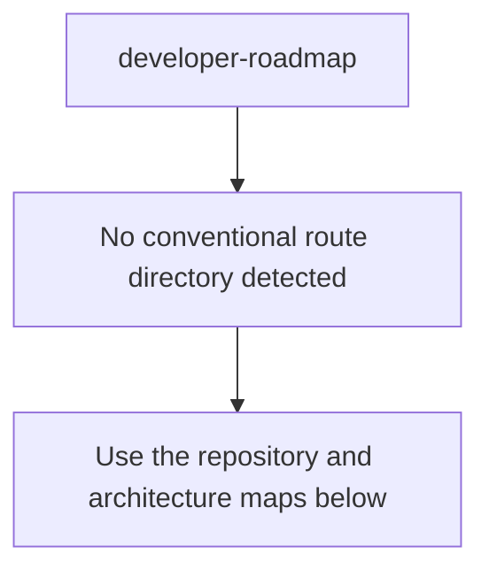
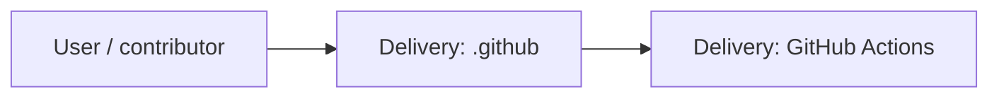
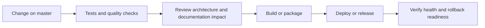
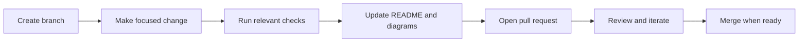

<!-- interactive-readme-standard:start -->

# developer-roadmap

**Branch-aware technical guide for [`master`](https://github.com/Nischhalsubba/developer-roadmap/tree/master)**

 

  <a href="https://github.com/Nischhalsubba/developer-roadmap/tree/master"><strong>Browse source</strong></a> ·
  <a href="https://github.com/Nischhalsubba/developer-roadmap/issues"><strong>Issues</strong></a> ·
  <a href="https://github.com/Nischhalsubba/developer-roadmap/codespaces/new?ref=master"><strong>Open in Codespaces</strong></a>

> [!IMPORTANT]
> This guide is generated from the files actually present on `master`. It links to detected source paths, preserves project-authored notes, and avoids claiming components that were not found.

## At a glance

| Item | Detected value |
|---|---|
| Purpose | Branch-specific project documentation generated from the repository structure without inventing missing capabilities. |
| Branch role | Default branch |
| Stack | No primary framework detected automatically |
| Manifests | No standard manifest detected |
| Prerequisites | Confirm from the detected manifests |
| Delivery | GitHub Actions |
| License | No license file detected |

## Branch scope

This is the repository's default branch.

## Quick start

> No reliable setup command was detected. Use the preserved project-authored notes and manifests rather than guessing.

### Configuration surface

- No committed environment example file was detected.

> Never commit secrets, private keys, production credentials, customer data, or unredacted infrastructure details.

## Repository map

| Responsibility | Detected source paths |
|---|---|
| Delivery | [`.github`](https://github.com/Nischhalsubba/developer-roadmap/tree/master/.github) |

## Website or application map

## Architecture and responsibility flow

## Quality, security, and operations

<table>
<tr>
<td width="33%" valign="top">

### Quality

- No conventional test directory was detected automatically.

Detected commands:
- No standard quality command detected.

</td>
<td width="33%" valign="top">

### Security

- No dedicated security policy or automated dependency configuration was detected.

Review authentication, authorization, input validation, dependency updates, secret handling, and failure recovery before release.

</td>
<td width="34%" valign="top">

### Observability

- No dedicated observability integration was detected automatically.

Define useful logs, metrics, traces, alerts, and rollback signals for production-facing branches.

</td>
</tr>
</table>

## Delivery flow

### Automation detected

- [`.github/workflows/apply-interactive-readme.yml`](https://github.com/Nischhalsubba/developer-roadmap/blob/master/.github/workflows/apply-interactive-readme.yml)

## Contribution flow

- Keep changes focused and explain architectural consequences.
- Run the checks relevant to the changed area.
- Update diagrams whenever routes, modules, data models, authentication, jobs, or delivery paths change.
- Add screenshots or recordings for visual behavior changes when useful.
- Use issues for reproducible defects and pull requests for reviewable changes.

## Ownership and support

| Topic | Source |
|---|---|
| Repository | [`Nischhalsubba/developer-roadmap`](https://github.com/Nischhalsubba/developer-roadmap) |
| Branch | [`master`](https://github.com/Nischhalsubba/developer-roadmap/tree/master) |
| Ownership | No CODEOWNERS file detected |
| Contributing | Use the contribution flow above |
| Support | [Open or review issues](https://github.com/Nischhalsubba/developer-roadmap/issues) |
| License | No license file detected |

<strong>Documentation maintenance checklist</strong>

- [ ] Purpose and branch scope are accurate.
- [ ] Setup and configuration commands still work.
- [ ] Repository, application, API, data, authentication, job, and deployment diagrams match the code.
- [ ] Tests, security controls, observability, and rollback behavior are documented.
- [ ] Links point to real files on this branch.
- [ ] No secrets or private operational details are exposed.

<!-- interactive-readme-standard:end -->

<!-- project-authored-notes:start -->

<strong>Project-authored notes preserved from this branch</strong>

# 🧭 Developer Roadmap Archive

### Frontend, Backend, and DevOps Learning Map

**A historical web-developer roadmap reference containing visual learning paths for frontend, backend, and DevOps skills. This repository is useful as a learning archive and early-career study planner.**

---

## ✨ Overview

**developer-roadmap** is a learning-roadmap archive originally focused on helping students understand the different paths into web development.

It contains roadmap visuals for:

- frontend development
- backend development
- DevOps

The content is historical, so it should be treated as a reference snapshot rather than a fully current roadmap for modern development.

---

## 🧭 Table of Contents

- [Purpose](#-purpose)
- [Designer’s Perspective](#-designers-perspective)
- [Roadmap Tracks](#-roadmap-tracks)
- [How To Use This Repo](#-how-to-use-this-repo)
- [Modern Learning Notes](#-modern-learning-notes)
- [Quality Checklist](#-quality-checklist)
- [Roadmap](#-roadmap)
- [License](#-license)

---

## 🎯 Purpose

The goal of this repo is to give learners a visual overview of the web development landscape.

It helps answer:

- What should a frontend developer learn?
- What should a backend developer learn?
- What does DevOps include?
- How do different tools and skills connect?
- What should a beginner explore first?

---

## 🎨 Designer’s Perspective

For a designer learning code, a roadmap is useful because it reduces overwhelm.

Instead of seeing development as one giant unknown field, the roadmap breaks it into paths:

- frontend: what users see and interact with
- backend: data, APIs, server logic
- DevOps: deployment, infrastructure, reliability

This is especially helpful for product designers who want to collaborate better with developers or become more front-end capable.

---

## 🛤 Roadmap Tracks

| Track | Focus |
|---|---|
| Frontend | HTML, CSS, JavaScript, browser APIs, UI frameworks, accessibility |
| Backend | server-side languages, databases, APIs, authentication, caching |
| DevOps | Linux, networking, CI/CD, cloud, containers, monitoring |

---

## 🚀 How To Use This Repo

Use this as a high-level guide, not as a strict checklist.

Recommended approach:

1. Pick one path.
2. Learn the basics first.
3. Build small projects.
4. Learn tools only when a project needs them.
5. Revisit the roadmap after real practice.
6. Update outdated items with modern alternatives.

---

## 🧠 Modern Learning Notes

Because this roadmap is historical, modern learners should also explore:

- TypeScript
- React / Vue / Svelte
- Next.js / Astro
- accessibility standards
- responsive design systems
- GitHub Actions
- Docker
- cloud hosting platforms
- API design
- security fundamentals
- testing and CI/CD

---

## ✅ Quality Checklist

- [ ] Treat roadmap images as historical references.
- [ ] Verify tools before learning deeply.
- [ ] Build projects instead of only reading maps.
- [ ] Learn accessibility and performance early.
- [ ] Keep frontend/backend/DevOps responsibilities clear.
- [ ] Update this repo if using it as a modern public resource.

---

## 🗺 Roadmap

- Add updated 2026 learning notes.
- Add links to current official docs.
- Add beginner-friendly project ideas per track.
- Add product designer learning path.
- Add modern frontend and deployment stack recommendations.

---

## 📜 License

Original roadmap content is licensed under **CC BY 4.0**.

---

A visual learning archive for understanding the web-development landscape.

<!-- project-authored-notes:end -->
