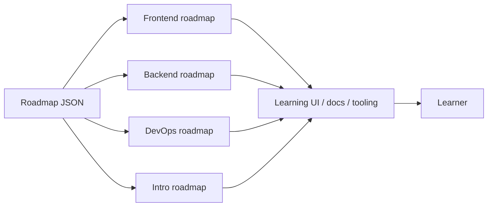
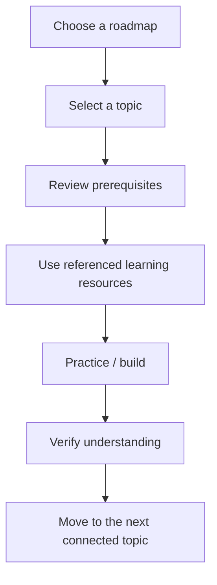
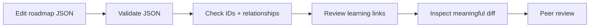

<div align="center">

# 🗺️ Developer Roadmap Data

**Structured roadmap data for frontend, backend, DevOps, and introductory developer-learning paths.**


[Browse roadmap data](./data) · [Detailed docs](./docs/README.md) · [Issues](https://github.com/Nischhalsubba/developer-roadmap/issues)

</div>

## Overview

This repository stores **developer roadmap content as structured JSON**, not a runnable application. The data can be consumed by learning tools, visual roadmap interfaces, documentation systems, or other clients that need explicit roadmap nodes and relationships.

| Audience | Use this repository for |
|---|---|
| Learners | Understand the intended progression across development topics |
| Developers | Consume or transform roadmap JSON into tools and interfaces |
| Educators | Review sequencing, prerequisites and learning coverage |
| Maintainers | Keep identifiers, labels, links and relationships consistent |

<details open>
<summary><strong>🏗️ Interactive data architecture</strong></summary>



</details>

## Learning flow



## Repository structure

```text
developer-roadmap/
├── data/
│   ├── backend-map.json
│   ├── devops-map.json
│   ├── frontend-map.json
│   └── intro-map.json
├── docs/
│   └── README.md
└── README.md
```

## Data maintenance principles

- Preserve valid JSON and deterministic formatting.
- Keep stable identifiers when nodes may be referenced externally.
- Make prerequisite and parent/child relationships explicit.
- Avoid duplicate topics unless context genuinely changes their meaning.
- Review outbound learning links for accuracy and relevance.
- Remove obsolete resources rather than preserving dead links for archaeological value.
- Do not add application scaffolding unless this repository actually gains a runtime.

## Contribution flow



## SEO and discoverability

This repository is naturally relevant to terms such as **developer roadmap, frontend developer roadmap, backend developer roadmap, DevOps roadmap, web development learning path, programming learning roadmap, and developer learning resources**. Keep filenames, headings, descriptions and documentation descriptive, but let the actual roadmap content carry the meaning instead of stuffing repetitive keywords into every document.

## For consumers

Treat the JSON files as maintained content contracts. A consuming application should validate expected fields, handle missing or stale resources gracefully, and avoid assuming the repository provides a web server, package manager, API, or executable build pipeline.

See [`docs/README.md`](./docs/README.md) for additional maintenance guidance.
