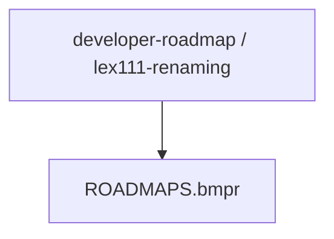
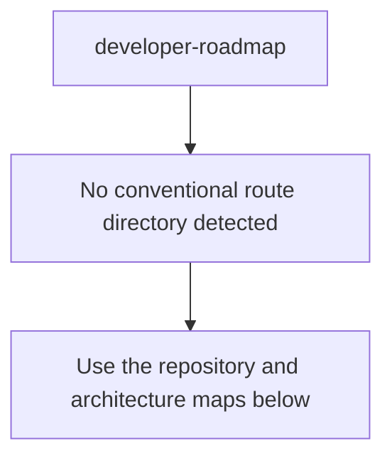
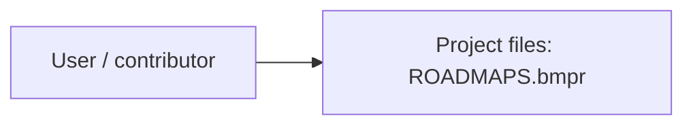
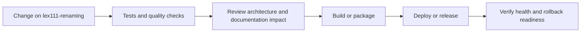
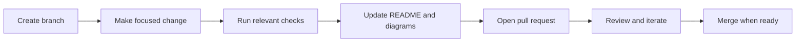

<!-- interactive-readme-standard:start -->

# developer-roadmap

**Branch-aware technical guide for [`lex111-renaming`](https://github.com/Nischhalsubba/developer-roadmap/tree/lex111-renaming)**

 

  <a href="https://github.com/Nischhalsubba/developer-roadmap/tree/lex111-renaming"><strong>Browse source</strong></a> ·
  <a href="https://github.com/Nischhalsubba/developer-roadmap/issues"><strong>Issues</strong></a> ·
  <a href="https://github.com/Nischhalsubba/developer-roadmap/codespaces/new?ref=lex111-renaming"><strong>Open in Codespaces</strong></a>

> [!IMPORTANT]
> This guide is generated from the files actually present on `lex111-renaming`. It links to detected source paths, preserves project-authored notes, and avoids claiming components that were not found.

## At a glance

| Item | Detected value |
|---|---|
| Purpose | Branch-specific project documentation generated from the repository structure without inventing missing capabilities. |
| Branch role | Compared with `master` |
| Stack | No primary framework detected automatically |
| Manifests | No standard manifest detected |
| Prerequisites | Confirm from the detected manifests |
| Delivery | No conventional deployment configuration detected |
| License | No license file detected |

## Branch scope

This branch differs from the default branch in the following detected paths:

- [`README.md`](https://github.com/Nischhalsubba/developer-roadmap/blob/lex111-renaming/README.md)

## Quick start

> No reliable setup command was detected. Use the preserved project-authored notes and manifests rather than guessing.

### Configuration surface

- No committed environment example file was detected.

> Never commit secrets, private keys, production credentials, customer data, or unredacted infrastructure details.

## Repository map

| Responsibility | Detected source paths |
|---|---|
| Project files | [`ROADMAPS.bmpr`](https://github.com/Nischhalsubba/developer-roadmap/blob/lex111-renaming/ROADMAPS.bmpr) |

## Website or application map

## Architecture and responsibility flow

## Quality, security, and operations

<table>
<tr>
<td width="33%" valign="top">

### Quality

- No conventional test directory was detected automatically.

Detected commands:
- No standard quality command detected.

</td>
<td width="33%" valign="top">

### Security

- No dedicated security policy or automated dependency configuration was detected.

Review authentication, authorization, input validation, dependency updates, secret handling, and failure recovery before release.

</td>
<td width="34%" valign="top">

### Observability

- No dedicated observability integration was detected automatically.

Define useful logs, metrics, traces, alerts, and rollback signals for production-facing branches.

</td>
</tr>
</table>

## Delivery flow

### Automation detected

- No GitHub Actions workflow files were detected.

## Contribution flow

- Keep changes focused and explain architectural consequences.
- Run the checks relevant to the changed area.
- Update diagrams whenever routes, modules, data models, authentication, jobs, or delivery paths change.
- Add screenshots or recordings for visual behavior changes when useful.
- Use issues for reproducible defects and pull requests for reviewable changes.

## Ownership and support

| Topic | Source |
|---|---|
| Repository | [`Nischhalsubba/developer-roadmap`](https://github.com/Nischhalsubba/developer-roadmap) |
| Branch | [`lex111-renaming`](https://github.com/Nischhalsubba/developer-roadmap/tree/lex111-renaming) |
| Ownership | No CODEOWNERS file detected |
| Contributing | Use the contribution flow above |
| Support | [Open or review issues](https://github.com/Nischhalsubba/developer-roadmap/issues) |
| License | No license file detected |

<strong>Documentation maintenance checklist</strong>

- [ ] Purpose and branch scope are accurate.
- [ ] Setup and configuration commands still work.
- [ ] Repository, application, API, data, authentication, job, and deployment diagrams match the code.
- [ ] Tests, security controls, observability, and rollback behavior are documented.
- [ ] Links point to real files on this branch.
- [ ] No secrets or private operational details are exposed.

<!-- interactive-readme-standard:end -->

<!-- project-authored-notes:start -->

<strong>Project-authored notes preserved from this branch</strong>

# developer-roadmap

> Roadmap to becoming a web developer in 2017

Below you find a set of charts demonstrating the paths that you can take and the technologies that you would want to adopt in order to become a frontend, backend or a devops guy. I made these charts for an old professor of mine who wanted something to share with his college students to give them a perspective.

If you think that these can be improved in anyway, please do suggest.

## 🚀 Introduction

## 🎨 Frontend Roadmap

## 👽 Backend Roadmap

For the backend, personally I would prefer Node JS and PHP-7 for the full time plus I have been experimenting lately with Go and I quite like it. Apart from these, if I have to choose another one, I would go for Ruby. However this is just my personal preference, you can choose any of the shown languages and you will be good.

## 👷 DevOps Roadmap

>Will be added any minute now.

 

## 🚦 Wrap Up

If you think any of the roadmaps can be improved, please do open a PR with any updates and submit any issues. Also, I will continue to improve this, so you might want to watch/star this repository to revisit.

## ☑ TODO

- [X] Add Frontend Roadmap
- [X] Add Backend Roadmap
- [ ] Add DevOps Roadmap (in progress)
- [ ] Add relevant resources for each

## 👬 Contribution

The roadmaps are built using [Balsamiq](https://balsamiq.com/products/mockups/). Project file can be found at `/ROADMAPS.bmpr`, open it in balsamiq, do the necessary modifications and create a PR.

- Open pull request with improvements
- Discuss ideas in issues
- Spread the word
- Reach out to me directly at kamranahmed.se@gmail.com or on twitter [@kamranahmedse](http://twitter.com/kamranahmedse)

## Licence

<!-- project-authored-notes:end -->
