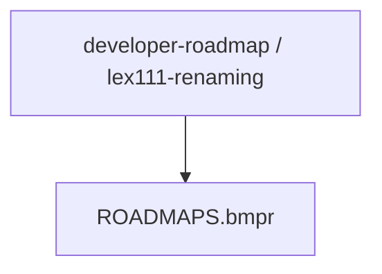
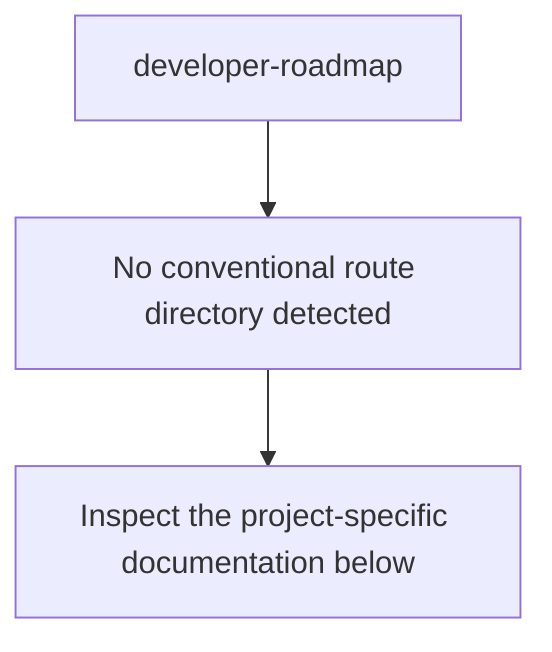
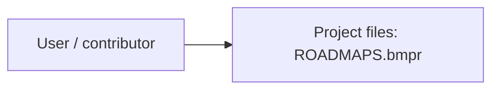
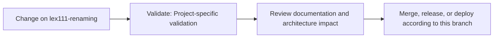

# developer-roadmap

<!-- interactive-readme-standard:start -->

> [!NOTE]
> **Branch-specific documentation:** this section is maintained for [`lex111-renaming`](https://github.com/Nischhalsubba/developer-roadmap/tree/lex111-renaming). It is generated from the files present on this branch and preserves the project-authored README below.

<strong>Interactive repository guide</strong>

## Branch overview

| Item | Value |
|---|---|
| Repository | [`Nischhalsubba/developer-roadmap`](https://github.com/Nischhalsubba/developer-roadmap) |
| Branch | [`lex111-renaming`](https://github.com/Nischhalsubba/developer-roadmap/tree/lex111-renaming) |
| Detected stack | No primary framework detected automatically |
| Detected manifests | No standard manifest detected |
| Documentation policy | Every maintained branch must explain purpose, setup, structure, architecture, flows, testing, delivery, security, and ownership. |

## Repository structure

The diagram is generated from the branch's actual top-level files and directories. Use the branch link above for complete source navigation.

## Website or application structure

## Application and responsibility flow

## Change-to-delivery flow

## README requirements for this branch

- Explain what this branch contains and how it differs from the default branch.
- Keep installation, configuration, usage, testing, deployment, security, support, and license information accurate.
- Document repository, website or application, API, data, authentication, background-job, and deployment flows when they exist.
- Prefer Mermaid diagrams and expandable `
` sections for visual navigation.
- Link diagrams and modules to real source paths; never invent missing components.
- Preserve project-specific documentation and update diagrams whenever architecture or major paths change.
- Treat secrets, private infrastructure, customer data, and credentials as prohibited README content.

<!-- interactive-readme-standard:end -->

> Roadmap to becoming a web developer in 2017

Below you find a set of charts demonstrating the paths that you can take and the technologies that you would want to adopt in order to become a frontend, backend or a devops guy. I made these charts for an old professor of mine who wanted something to share with his college students to give them a perspective.

If you think that these can be improved in anyway, please do suggest.

## 🚀 Introduction

## 🎨 Frontend Roadmap

## 👽 Backend Roadmap

For the backend, personally I would prefer Node JS and PHP-7 for the full time plus I have been experimenting lately with Go and I quite like it. Apart from these, if I have to choose another one, I would go for Ruby. However this is just my personal preference, you can choose any of the shown languages and you will be good.

## 👷 DevOps Roadmap

>Will be added any minute now.

 

## 🚦 Wrap Up

If you think any of the roadmaps can be improved, please do open a PR with any updates and submit any issues. Also, I will continue to improve this, so you might want to watch/star this repository to revisit.

## ☑ TODO

- [X] Add Frontend Roadmap
- [X] Add Backend Roadmap
- [ ] Add DevOps Roadmap (in progress)
- [ ] Add relevant resources for each

## 👬 Contribution

The roadmaps are built using [Balsamiq](https://balsamiq.com/products/mockups/). Project file can be found at `/ROADMAPS.bmpr`, open it in balsamiq, do the necessary modifications and create a PR.

- Open pull request with improvements
- Discuss ideas in issues
- Spread the word
- Reach out to me directly at kamranahmed.se@gmail.com or on twitter [@kamranahmedse](http://twitter.com/kamranahmedse)

## Licence

